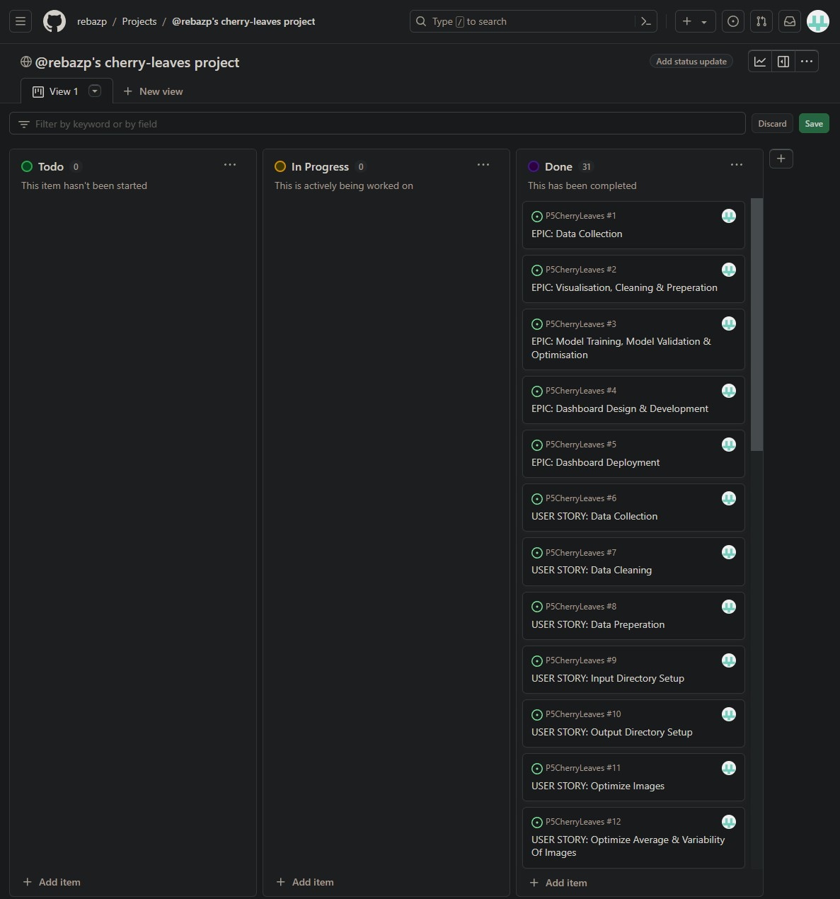
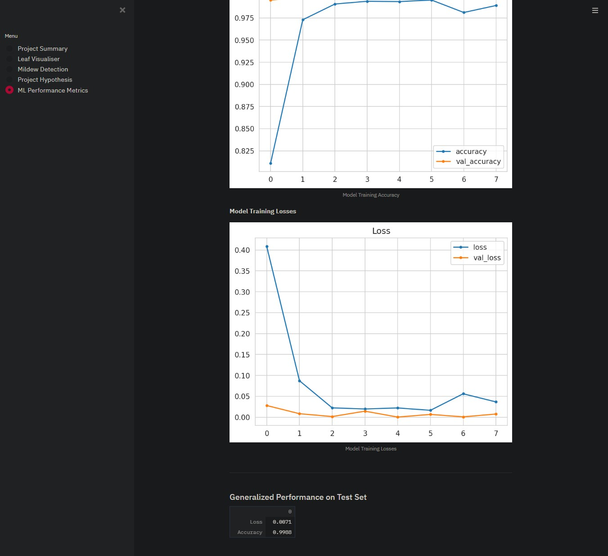

# Cherry Leaves
* Powdery mildew is a common fungal disease affecting a wide variety of plants, caused by diverse species of ascomycete fungi in the Erysiphales order. Its identification is relatively simple due to distinctive symptoms such as white powdery spots on leaves and stems. Although lower leaves are often most affected, the mildew can appear on any above-ground part of the plant. As the disease progresses, the spots enlarge and become denser due to the formation of numerous asexual spores, potentially spreading throughout the plant. This fungus thrives in environments with high humidity and moderate temperatures, making greenhouses particularly susceptible to its spread, posing a threat to agricultural and horticultural practices. Control methods include chemical treatments, bio-organic approaches, and genetic resistance.

* In agricultural settings, powdery mildew can be managed through various methods such as chemical control, genetic resistance, and employing careful farming practices. To prevent the disease, farmers can choose powdery mildew-resistant plant varieties and alternate between resistant and susceptible varieties to hinder pathogen adaptation. Additionally, reducing humidity by spacing plants for airflow and pruning foliage can help mitigate its spread. Conventional chemical control involves the use of standard fungicides, with spray programs recommended upon initial detection of symptoms. Regular application of fungicides like triadimefon, propiconazole, hexaconazole, myclobutanil, and penconazole is advised for optimal results. Non-conventional methods include utilizing substances like milk, natural sulfur, potassium bicarbonate, metal salts, and oils, each offering alternative modes of action against powdery mildew. Metal salt fungicides should be applied regularly until harvest, sulfur should be applied preemptively to inhibit spore germination, and copper sulfate, although effective in organic farming, may require lime to mitigate its adverse effects on plants.

* The goal is to create a ML model that can predict if a cherry leaf is infected with powdery mildew or uninfected. The model need to have a accuracy rate of minimum 97% and my model reached 100% accuracy.

[View Live Version Here](https://cherry-leaves-live-8f4fa15591ea.herokuapp.com/)

# Table of Contents
* [Dataset Content](#dataset-content)
* [Business Requirements](#business-requirements)
* [Hypothesis & How To Validate](#hypothesis--how-to-validate)
* [The Rationale To Map The Business Requirements To The Data Visualizations & ML Tasks](#the-rationale-to-map-the-business-requirements-to-the-data-visualizations--ml-tasks)
* [ML Business Case](#ml-business-case)
* [Dashboard Design](#dashboard-design)
* [CRISP DM Process](#cross-industry-standard-process-for-data-mining)
* [Bugs](#bugs)
* [Unfixed Bugs](#unfixed-bugs)
* [Testing](#testing)
* [Deployment](#deployment)
* [Technologies Used](#technologies-used)
* [Main Data Analysis & Machine Learning Libraries](#main-data-analysis--machine-learning-libraries)
* [Credits](#credits)
* [Content](#content)
* [Acknowledgements](#acknowledgements)

## Dataset Content
* The dataset used in this project is sourced from [Kaggle](https://www.kaggle.com/codeinstitute/cherry-leaves). I created a user story where predictive analytics can be applied in a real project in the workplace.
* The dataset contains over 4,000 images taken from the client's cherry plantation. The images show healthy cherry leaves and leaves that have been infected with powdery mildew. Since the cherry plantation crop is one of the finest products in the client's portfolio, the quality of the product is of high concern for the company.

## Business Requirements

Farmy & Foods is grappling with powdery mildew affecting their cherry plantation crop, leading to inefficient manual inspection processes. Employees spend 30 minutes per tree visually identifying and treating infected trees with a specific compound. With thousands of cherry trees spread across multiple farms, scalability becomes a significant issue. To address this, the IT team proposes implementing a machine learning (ML) system to instantly detect powdery mildew in cherry trees using leaf images. Success in this endeavor could pave the way for similar initiatives in detecting pests in other crops, utilizing datasets comprising cherry leaf images provided by Farmy & Foods.

* 1 - The client is interested in conducting a study to visually differentiate a healthy cherry leaf from one with powdery mildew.
* 2 - The client is interested in predicting if a cherry leaf is healthy or contains powdery mildew.

## Hypothesis & How To Validate

### Hypothesis
* Cherry tree foliage afflicted by powdery mildew displays unique visual characteristics when contrasted with the appearance of healthy cherry leaves.

### Validation
* **Dataset Examination**: Confirm the hypothesis through exploratory data analysis (EDA) of the dataset, employing techniques like visualizing samples of both healthy and powdery mildew-affected cherry leaves to detect any discernible patterns or distinctions.

* **Model Creation**: Develop a machine learning (ML) model utilizing Convolutional Neural Networks (CNNs) to discern between healthy and powdery mildew-infected cherry leaves. Validate the model's efficacy and performance using suitable validation methods.

* **Assessment**: Assess the model's effectiveness on an independent test set to verify its capacity to generalize. Utilize metrics like accuracy to gauge its proficiency in identifying powdery mildew.

## The Rationale To Map The Business Requirements To The Data Visualizations & ML Tasks

#### Business Requirements
* **Visual Discrimination**: Utilize visual representations of cherry leaf images to distinguish between healthy leaves and those afflicted by powdery mildew. This facilitates the identification of any unique features present in affected leaves.

* **Prediction**: Construct a machine learning (ML) model capable of predicting whether a cherry leaf is healthy or infected with powdery mildew, based on visual cues extracted from the images.

#### Rationale
* **Data Visualization**: Employing visual analysis of the dataset aids in comprehending the characteristics and disparities within healthy and afflicted cherry leaves, facilitating the selection and extraction of relevant features for model development.

* **ML Tasks**: Implementing Convolutional Neural Networks (CNNs) harnesses the power of deep learning to automatically discern and recognize intricate patterns within images, thereby enabling precise classification between healthy and affected leaves.

## ML Business Case
* **Enhanced Efficiency**: The adoption of a machine learning (ML) system for immediate identification of powdery mildew on cherry leaves leads to a substantial reduction in manual inspection time, thereby enhancing the overall efficiency of the process.

* **Scalability & Reproducibility**: Achieving success in this initiative has the potential to facilitate the deployment of comparable ML-driven detection systems for various other crops. This would bolster scalability and reproducibility across diverse agricultural contexts.

## Dashboard Design

### **Project Overview**

* Provides an extensive summary of powdery mildew, a fungal disease impacting cherry trees, detailing its characteristics, effects, and management approaches.
* Describes powdery mildew as a fungal infection affecting various plants, notably cherry trees, thriving in warm, humid conditions.
* Explains its appearance as a powdery, white growth on leaves, shoots, and sometimes on the fruit.
* Notes that the dataset is acquired from Kaggle and includes images of both healthy cherry leaves and leaves affected by powdery mildew.
* Encourages readers to refer to the Project README file for additional information.
* Highlights the project's primary business requirements: 
* Visually differentiating between healthy and powdery mildew-infected cherry leaves 
* Developing a predictive model for leaf health assessment.

#### **Dataset Details**

* Obtained from Kaggle, comprising over 4,000 images from the client's crop fields, showcasing healthy and powdery mildew-infected cherry leaves.
* Promotes exploration of the dataset and encourages reading of the README file for deeper insights.

#### **Business Objectives**

* The client is interested in conducting a study to visually differentiate a healthy cherry leaf from one with powdery mildew.

* The client is interested in predicting if a cherry leaf is healthy or contains powdery mildew.

### **Project Hypothesis**

* States that powdery mildew-affected cherry leaves display distinct visual patterns, particularly along the leaf edges, distinguishing them from healthy leaves.
* Emphasizes the identification of these unique patterns and proposes validation through exploratory data analysis (EDA) on the dataset, including visualization of healthy and affected cherry leaf samples.

### **Leaf Visualizer**

* Generates healthy and mildew-infected leaves for visual comparison, aiding in distinguishing between the two.
* Allows users to refresh the montage, select labels for viewing specific subsets of images, and adjust montage sizes.
* Provides a grid of randomly selected images based on chosen labels for visual inspection.

#### **Visual Contrast**

* Discernible variances are noted between typical and variant images.
* The shapes of both powdery mildew-infected and healthy leaves remain identifiable.
* Notable variations in color distinguish between healthy and powdery mildew-infected leaves, with healthy leaves displaying a more vibrant green hue.
* Users can update the montage by activating the 'Create Montage' option.
* The tool permits users to choose labels to view specific image subsets.
* It presents a grid of randomly selected images corresponding to the selected label.
* Users can customize montage dimensions by adjusting the number of rows and columns.

### **Mildew Identification**

* The client's aim is to ascertain whether a specific leaf is afflicted by mildew.

#### **Real-Time Prediction & Data Retrieval**
* Enables users to upload samples of mildew-infected leaves for immediate prediction.

* Offers the choice to acquire a collection of mildew-infected and healthy leaf images from Kaggle.

#### **Real-Time Prediction Feature**
* Users have the option to upload individual or multiple leaf images for assessment.

* Provides details regarding the uploaded image(s) such as name and size.

* Adjusts the size of the uploaded image(s) to fit the prediction model (via the resize_input_image function).

* Utilizes a pre-existing model to forecast the likelihood and classification of mildew infection (through the load_model_and_predict function).

* Visualizes the predictions and their corresponding probabilities (via the plot_predictions_probabilities function).

#### **Analysis Report**

* Produces a report table presenting the names of uploaded images alongside their respective prediction outcomes.

* Offers the choice to download the report as a CSV file.

### **ML Performance**

#### **Train, Validation, & Test Set Label Distribution**
* Illustrates the distribution of labels across the training, validation, and test datasets through an image display.

#### **Model Progression**
* Graphically represents the training accuracy and losses of the model throughout its training period.

* Consists of distinct images illustrating the model's training accuracy (model_training_acc.png) and training losses (model_training_losses.png).

#### **Overall Performance on Test Set**
* Offers a structured presentation of the model's evaluation metrics on the test dataset.

* Retrieves and showcases the evaluation outcomes for loss and accuracy using the load_test_evaluation function.

## CRISP-DM
CRISP-DM, an acronym for Cross-Industry Standard Process for Data Mining, is a well-established approach utilized to steer data mining endeavors.

* In its capacity as a methodology, CRISP-DM delineates the common stages of a project, the associated tasks within each stage, and elucidates the interconnections among these tasks.

* Functioning as a process model, CRISP-DM furnishes an outline of the data mining life cycle.

**Source**: [IBM - Crisp Overview](https://www.ibm.com/docs/it/spss-modeler/saas?topic=dm-crisp-help-overview)

**The procedure is documented utilizing the Kanban Board available through GitHub within the project section of this repository.** [Cherry Leaves Project](https://github.com/users/rebazp/projects/7)

* A kanban board serves as an agile project management tool aimed at aiding in the visualization of tasks, controlling work-in-progress, and optimizing efficiency, also known as flow. It's beneficial for both agile and DevOps teams in structuring their daily tasks. Kanban boards utilize cards, columns, and a focus on continuous improvement to assist technology and service teams in committing to an appropriate workload and completing it effectively.

* The CRISP-DM process is segmented into sprints, with each sprint containing Epics derived from individual CRISP-DM tasks, which are then further subdivided into tasks. Each task progresses through stages such as To Do, In Progress, and Review status as part of the workflow, and includes comprehensive details.

## Bugs
* During the deployment to Heroku the project size was to big, around 550 MB while the limit on Heroku is 500 MB. To solve this I had to remove most of the images from the input folders to meet the Heroku requirements. I also had to make some changes to the .slugignore file to decompress the project.

* When deploying my project to Heroku I encounter bugs with my RGB chart not loading properly. I tried different solutions in my ml_performance.py and .slugignore with no luck. In the end I decided to remove the RGB chart entirely from the ml_performance.py page.

## Unfixed Bugs
* There is no unfixed bugs.

## Testing
* In this project, only manual testing has been conducted. The functionality of all aspects of the application has been verified on Streamlit and Heroku, and they operate as intended.

| **Feature**       | **Expected Outcome**                                                       | **Testing Performed**                                            | **Result**                            | **Pass/Fail** |
|:-----------------:|:--------------------------------------------------------------------------:|:----------------------------------------------------------------:|:-------------------------------------:|:-------------:|
| Nav links         | Nav links should load the corresponding page                               | Click the nav links                                              | All links open the appropriate pages  | Pass          |
| Links             | Links should load the appropriate content                                  | Click the kaggle link                                       | Link loads the kaggle mildew data page            | Pass          |
| Show information checkboxes         | Checkboxes should display the appropriate information when clicked | Click the checkboxes                                                   | Displays the appropriate content           | Pass          |
| Mildew detection page | User should be able to upload multiple images and each images should be displayed and should display weather the leaf is healthy or infected with a confidence percentage. Then there should be a summary at the bottom of all the images and their results.                                | Upload multiple images to mildew detector | All images are displayed with their results and the summary is displayed at the bottom | Pass          |
| Upload image button | Clicking this button should allow the user to select an image from their pc                                | Click the upload image button | Loads a popup allowing user to select images from their pc | Pass          |
| Download prediction link | Clicking this link should allow the user to download the prediction data into a csv file                                | Click the download prediction results link | Prediction data is downloaded as a csv | Pass          |
| Add new images to mildew detection when there are already images  | User should be able to upload a new image while there are already images loaded                                 | Upload a new image while there are already images loaded | New image is displayed and results are added to the summary and the old images are retained  | Pass          |
| Remove image "X" button             | This button should remove an image from the detector page and results from the summary                                  | Click the "X" button                                       | Image and results are removed     | Pass          |

### Project Summary
* Entering the streamlit project your are welcomed to the project summary page containing a short summary of the project.

### Leaf Visualizer
* Choosing the difference between average and variability image we get the desired action.

* Choosing the difference between average mildew infected and uninfected leaves we get the desired action.

* Choosing the image montage healthy we get the desires action.

* Choosing the image montage powdery_mildew we get the desires action.

### Mildew Detection
* Uploading a picture from the dataset we can see if the leaf is infected or uninfected.

### Project Hypothesis
* Entering the Project Hypothesis page we can read a short hypothesis for the project.

### ML Performance Metrics
* Entering the ML Performance Metric page we can see the train, validation and test sets. Model history and a RGB chart.

## Deployment

### Heroku

* The App live link is: https://cherry-leaves-live-8f4fa15591ea.herokuapp.com/ 
* Set the runtime.txt Python version to a [Heroku-20](https://devcenter.heroku.com/articles/python-support#supported-runtimes) stack currently supported version.
* The project was deployed to Heroku using the following steps.

1. Create a requirement.txt file in GitHub, for Heroku to read, listing the dependencies the program needs in order to run.
2. Set the runtime.txt Python version to a Heroku-20 stack currently supported version.
3. Push the recent changes to GitHub and go to your Heroku account page to create and deploy the app running the project.
4. Chose "CREATE NEW APP", give it a unique name, and select a geographical region.
5. Add heroku/python buildpack from the Settings tab.
6. From the Deploy tab, chose GitHub as deployment method, connect to GitHub and select the project's repository.
7. Select the branch you want to deploy, then click Deploy Branch.
8. Click to "Enable Automatic Deploys " or chose to "Deploy Branch" from the Manual Deploy section.
9. Wait for the logs to run while the dependencies are installed and the app is being built.
10. The mock terminal is then ready and accessible from a link similar to https://your-projects-name.herokuapp.com/
11. If the slug size is too large then add large files not required for the app to the .slugignore file.

## Technologies Used

### Platforms
* [Heroku](https://en.wikipedia.org/wiki/Heroku) Deploy this project
* [Jupiter Notebook](https://jupyter.org/) Edit code for this project
* [Kaggle](https://www.kaggle.com/) Download datasets for this project
* [GitHub](https://github.com/) Store the project code after being pushed from Gitpod.
* [Gitpod](https://www.gitpod.io/) Write the code and its terminal to 'commit' to GitHub and 'push' to GitHub Pages.

### Languages
* [Python](https://www.python.org/)
* [Markdown](https://en.wikipedia.org/wiki/Markdown)

## Main Data Analysis & Machine Learning Libraries
* NumPy: NumPy stands as a cornerstone package for scientific computation in Python, furnishing comprehensive support for arrays, matrices, and a suite of mathematical functions tailored for operation on these arrays. In this project, NumPy is extensively employed during data preparation tasks.

* Pandas: Integral for data manipulation, cleansing, and analysis, Pandas is instrumental in facilitating various operations such as loading datasets, refining data, conducting exploratory data analysis (EDA), and structuring data for modeling purposes.

* Matplotlib, employed in conjunction with Seaborn, is utilized to craft customizable and high-quality plots and visualizations, offering precise control over the visual aspects of graphical representations.

* Seaborn: Seaborn, renowned for its capacity to craft visually captivating statistical visualizations, plays a pivotal role in producing diverse plots and statistical graphics to elucidate patterns or relationships inherent within the data.

* Streamlit: Streamlit, a Python library, is employed to develop web applications tailored for data science and machine learning ventures, streamlining the conversion of data scripts into accessible web applications. Within this project, Streamlit serves as a dashboard interface.

* Jupyter: Jupyter, an open-source web application, allows users to author and distribute documents containing live code, mathematical equations, visualizations, and narrative text. Throughout this project, Jupyter serves as an open integrated development environment (IDE) utilized during data collection and machine learning phases to enhance visualization of the processes.

* Tensorflow: TensorFlow, an open-source machine learning framework created by Google, is extensively utilized for constructing and training machine learning models. Within this project, TensorFlow played a crucial role in the machine learning phase, particularly during the training of the model.

* PIL (Python Imaging Library): Utilized for managing image data within the project, including tasks such as image preprocessing, loading, saving, or basic manipulation of images within the mildew detector page on Streamlit.

* Base64: Employed for encoding and decoding binary image data in the data_management.py file.

* Joblib: Utilized for caching or executing specific functions in parallel, particularly beneficial in machine learning tasks that involve repetitive computations or grid searches for hyperparameter tuning. The joblib library is specifically used for loading Pickle (.pkl) files through the load_pkl_file function.

* Datetime: Utilized for handling timestamps, managing date-related computations, or parsing dates and times, particularly relevant in scenarios involving time-series data or logging. In this project, datetime is utilized to generate a timestamp in a specific format, which is then integrated into the filename while creating a downloadable report.

* Itertools: A module within Python's standard library offering various tools for efficiently creating and working with iterators. The itertools library is employed within the image_montage function to generate combinations of row and column indices for arranging images in a grid-like layout.

* Random: The random library is employed in the image_montage function to select images randomly in cases where the number of images in a directory surpasses the available grid spaces for the montage.

* OS: Utilized for managing file paths.

## Credits 

* The entirety of the code utilized in this project originates from the Malaria Detector tutorial video series included in the course material. I followed the video series to create the notebooks and dashboard, making adjustments to the code to suit my project's requirements. The initial template for starting the project is based on the one provided in the course material.

### Content 

The content presented on the project summary page draws inspiration from:
- [Treefruit](https://treefruit.wsu.edu/crop-protection/disease-management/cherry-powdery-mildew/#:~:text=Powdery%20mildew%20of%20sweet%20and,1)
- [Garden Design](https://www.gardendesign.com/how-to/powdery-mildew.html)
- [Wikipedia](https://en.wikipedia.org/wiki/Powdery_mildew)

## Acknowledgements
* I would like to thank my mentor Rohit Sharma for guiding me during this project.
* Code Institute for the code and techniques used during this project.
* Slack for the help during troubleshooting and bugs.
